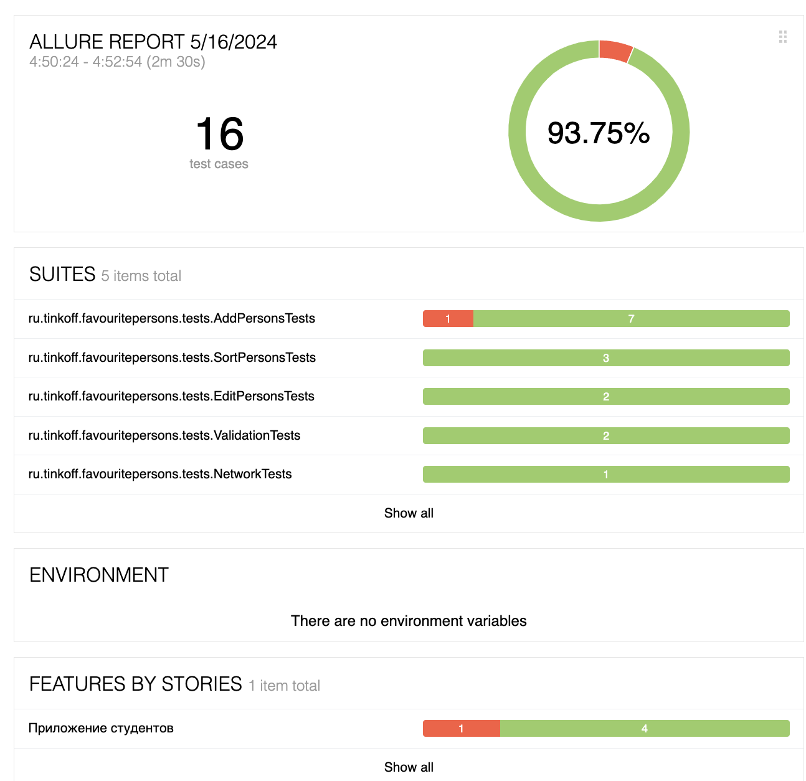
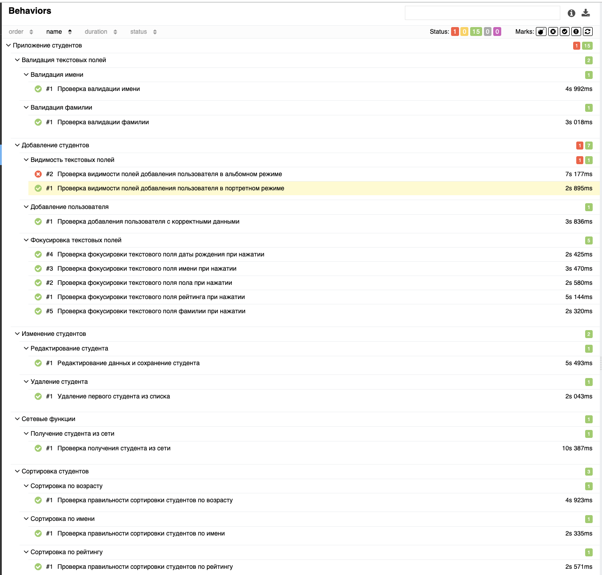

# Приложение студентов
Тесткейсы по которым писались тесты - [Тык](https://docs.google.com/spreadsheets/d/1eUz2PgQiecIPjbFVz0d8fqe0psrHI1aYDPOAHN1pOBw/edit?usp=sharing)
## Информация по запуску и комментарии
Для запуска тестов необходимо склонировать проект к себе на устройство либо скачать архив с проектом.

Тесты находятся по пути: **androidTest->java->java->/ru/tinkoff/favouritepersons/tests**

Номер каждого тесткейса подписан над самим тестом. Также в коде оставлены комментарии по поводу некоторых проблем и пояснения почему я что-либо так реализовал

## Важно
На всякий случай еще тут напишу, что параметризированные тетсы нужно запускать не по отдельности, а сразу все вместе, более подробно описано комментарием в коде

## Скриншоты Allure

